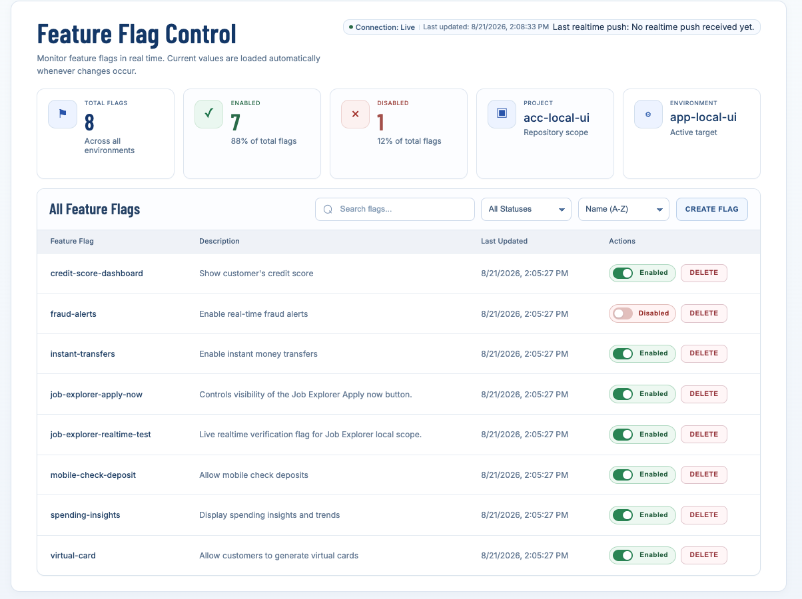
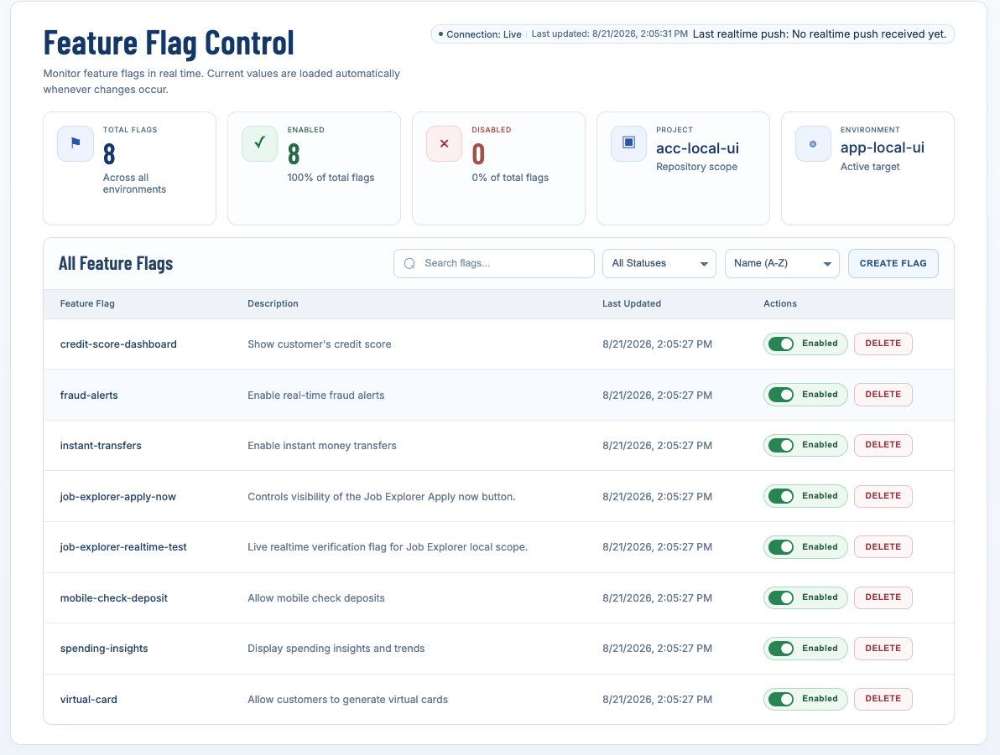
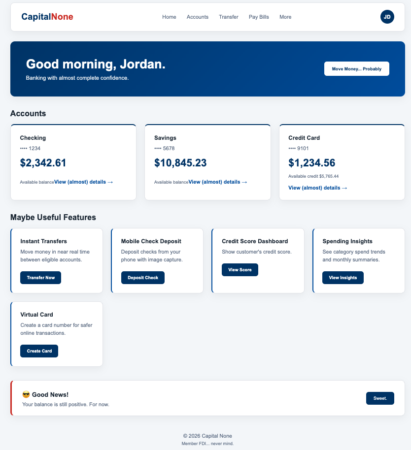
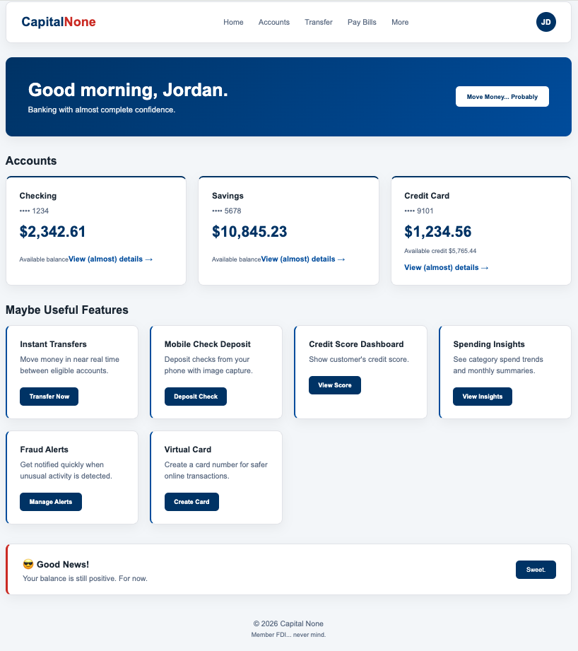
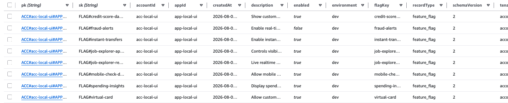
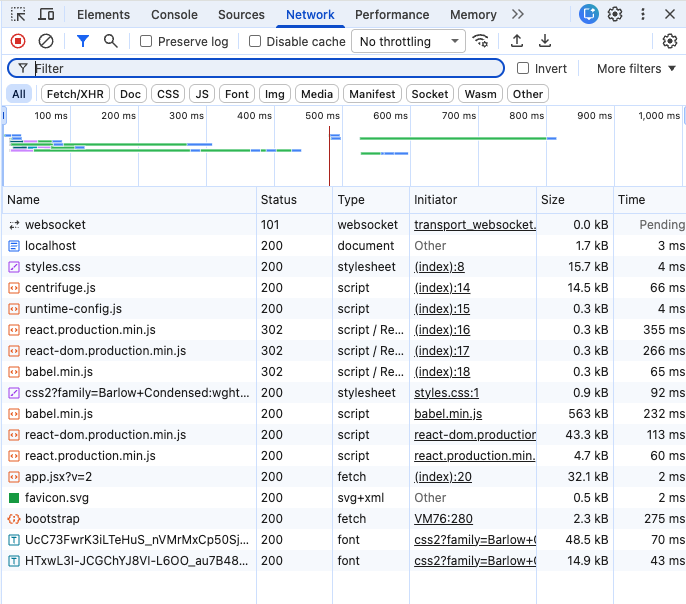

# 🚩 Feature Flag Management Platform

An AWS-based feature flag platform for managing, evaluating, and delivering tenant-scoped feature flags to applications in realtime.

Built with a TypeScript/OpenFeature SDK, DynamoDB, AWS Lambda, Kafka/MSK, Centrifugo, ECS/Fargate, and OpenTofu, the platform demonstrates an end-to-end feature flag architecture where application behavior can be changed without requiring a new deployment.


---

## 📸 Project Preview

The operator-facing dashboard provides a centralized interface for viewing and managing feature flags.

In the example below, the `fraud-alerts` flag changes from **disabled** to **enabled**. The dashboard simultaneously updates its summary from **7 enabled / 1 disabled** to **8 enabled / 0 disabled**.

<!-- ============================================================
IMAGE 1 OF 6
Feature Flag Control BEFORE enabling fraud-alerts

Save as:
docs/images/dashboard-flag-disabled.png
============================================================= -->

### Before — Flag Disabled



<!-- ============================================================
IMAGE 2 OF 6
Feature Flag Control AFTER enabling fraud-alerts

Save as:
docs/images/dashboard-flag-enabled.png
============================================================= -->

### After — Flag Enabled



The management interface supports flag creation, deletion, search, filtering, sorting, and enable/disable controls while displaying the current application and environment scope.

---

## 🎯 Project Overview

Modern applications often need to release, hide, test, or modify features independently from application deployments.

This project demonstrates a standalone feature flag platform designed around that problem.

Operators manage feature flags through a centralized platform while consuming applications evaluate those flags through a reusable TypeScript SDK and OpenFeature integration.

Feature flag state is persisted in DynamoDB. Changes can then travel through an event-driven realtime pipeline using DynamoDB Streams, AWS Lambda, Kafka/MSK, and Centrifugo before reaching connected applications.

The result is a separation between **deploying application code** and **controlling whether a feature is available**.

This repository is a standalone portfolio implementation and architectural demonstration rather than a production-certified hosted service.

---

## ✨ Key Features

- 🚩 **Feature Flag Management** — Create, view, enable, disable, and delete application feature flags.
- 🔐 **Tenant-Scoped Authentication** — Scope feature flag access and realtime communication between consumers.
- ⚡ **Realtime Delivery** — Deliver flag changes to connected applications through a persistent realtime connection.
- 📦 **TypeScript SDK** — Provide consuming applications with a reusable interface for feature flag evaluation.
- 🔌 **OpenFeature Integration** — Support standards-based feature flag evaluation through OpenFeature.
- ⚛️ **React & Next.js Integration** — Include React entry points and a Next.js/OpenFeature integration example.
- 🗄️ **Persistent Flag Storage** — Store feature flag state and metadata in DynamoDB.
- ☁️ **AWS Infrastructure** — Use AWS services for compute, persistence, streaming, identity, and networking.
- 🏗️ **Infrastructure as Code** — Define and validate cloud resources using OpenTofu.
- 🔄 **Automated CI** — Validate builds, integrations, infrastructure configuration, dependencies, and repository security through GitHub Actions.

---

## 🏗️ System Architecture

The platform separates feature management, persistent storage, event propagation, realtime delivery, and application consumption.

```text
                    ┌──────────────────────┐
                    │   Operator / Admin   │
                    └──────────┬───────────┘
                               │
                               ▼
                    ┌──────────────────────┐
                    │ Feature Flag Control │
                    └──────────┬───────────┘
                               │
                               ▼
                    ┌──────────────────────┐
                    │   Feature Flag API   │
                    └──────────┬───────────┘
                               │
                               ▼
                    ┌──────────────────────┐
                    │       DynamoDB       │
                    └──────────┬───────────┘
                               │
                       DynamoDB Streams
                               │
                               ▼
                    ┌──────────────────────┐
                    │  Lambda Publisher    │
                    └──────────┬───────────┘
                               │
                               ▼
                    ┌──────────────────────┐
                    │    Kafka / MSK       │
                    └──────────┬───────────┘
                               │
                               ▼
                    ┌──────────────────────┐
                    │     Centrifugo       │
                    │    ECS / Fargate     │
                    └──────────┬───────────┘
                               │
                         WebSocket / WSS
                               │
                               ▼
                    ┌──────────────────────┐
                    │ Consumer Application │
                    └──────────────────────┘
```

The platform's API behavior, authentication claims, DynamoDB schema, Kafka topics, Centrifugo channels, and AWS resource behavior form its primary runtime contracts.

---

## 🔄 End-to-End Feature Flag Flow

A feature flag change follows this general path through the platform:

1. An operator creates or changes a feature flag.
2. The feature flag API processes the request.
3. Current flag state is persisted in DynamoDB.
4. DynamoDB Streams captures the data change.
5. A Lambda stream publisher publishes the change to Kafka.
6. The Centrifugo bridge processes the tenant-scoped event.
7. Centrifugo delivers realtime information to connected clients.
8. The consuming application evaluates the new flag state.
9. Application behavior changes according to that state.

This architecture allows application functionality to be controlled independently from application deployments.

---

## ⚡ Feature Flags in a Consumer Application

The repository includes consumer implementations demonstrating how another application can use the feature flag platform.

The example below demonstrates the effect of the `fraud-alerts` feature flag.

When the flag is disabled, **Fraud Alerts is not presented as an available feature** in the consumer application.

<!-- ============================================================
IMAGE 3 OF 6
Consumer application BEFORE enabling fraud-alerts.
The Fraud Alerts card should NOT be visible.

Save as:
docs/images/consumer-flag-disabled.png
============================================================= -->

### Before — Feature Hidden



After the flag is enabled, the consumer can expose the corresponding **Fraud Alerts** functionality.

<!-- ============================================================
IMAGE 4 OF 6
Consumer application AFTER enabling fraud-alerts.
The Fraud Alerts card SHOULD now be visible.

Save as:
docs/images/consumer-flag-enabled.png
============================================================= -->

### After — Feature Available



This demonstrates the core purpose of the platform:

> **Application functionality can be controlled through feature flag state rather than requiring a new application deployment.**

Other demonstration flags control features such as instant transfers, mobile check deposit, credit score functionality, spending insights, and virtual cards.

---

## 🔍 Under the Hood

The visible UI behavior is backed by persistent feature flag records and realtime client connectivity.

### DynamoDB Feature Flag Storage

Feature flags are persisted as structured records in DynamoDB.

<!-- ============================================================
IMAGE 5 OF 6
AWS DynamoDB screenshot showing the feature flag records.

Use the screenshot showing:
- flagKey
- enabled
- environment
- appId
- accountId
- description
- recordType
- schemaVersion

Save as:
docs/images/dynamodb-feature-flags.png
============================================================= -->



Flag records contain information such as:

- Flag key
- Enabled/disabled state
- Application scope
- Account scope
- Environment
- Description
- Record type
- Schema version
- Creation metadata

This allows the platform to maintain persistent feature state while distinguishing flags across application and tenant contexts.

### Realtime Client Connection

Connected browser applications establish a persistent realtime connection for receiving updates.

<!-- ============================================================
IMAGE 6 OF 6
Chrome DevTools Network screenshot.

Make sure the screenshot visibly shows:
- websocket
- Status 101
- Type websocket
- Pending connection
- centrifuge.js

Save as:
docs/images/websocket-connection.png
============================================================= -->



The browser network trace above shows the successful WebSocket protocol upgrade with status **101** and a persistent connection.

The consumer uses the Centrifugo client as part of the realtime delivery layer.

Together, the screenshots demonstrate multiple layers of the system:

```text
Management UI
     │
     ▼
Feature Flag State
     │
     ▼
Persistent Storage
     │
     ▼
Realtime Connectivity
     │
     ▼
Consumer Behavior
```

---

## 📦 Consumer SDK

The platform includes a reusable TypeScript SDK so consuming applications do not need to implement the underlying feature flag API and evaluation behavior independently.

The SDK includes support for:

- TypeScript interfaces
- Feature flag evaluation
- React integration
- OpenFeature provider integration
- Browser-compatible build artifacts
- Consumer integration patterns

Applications can therefore integrate at the SDK/OpenFeature layer rather than directly coupling application code to the platform's infrastructure.

For additional integration details, see:

- [`consumer-sdk/README.md`](consumer-sdk/README.md)
- [`docs/consumer-integration.md`](docs/consumer-integration.md)
- [`examples/next-openfeature/README.md`](examples/next-openfeature/README.md)

---

## 🔌 OpenFeature Integration

The repository includes an OpenFeature integration that demonstrates standards-based feature flag evaluation.

A Next.js example is provided under:

```text
examples/next-openfeature/
```

This demonstrates how an application can consume the platform through an OpenFeature provider rather than depending directly on platform-specific evaluation logic.

---

## 🛠️ Technology Stack

| Area | Technologies |
| --- | --- |
| **Application** | Node.js, JavaScript, TypeScript, React, Next.js |
| **Feature Flags** | OpenFeature, Custom TypeScript SDK |
| **Cloud** | AWS |
| **Compute** | AWS Lambda, ECS/Fargate |
| **Storage** | DynamoDB, DynamoDB Streams |
| **Realtime / Messaging** | Kafka / Amazon MSK, Centrifugo, WebSockets |
| **Authentication** | JWT-based application and tenant scoping |
| **Infrastructure** | OpenTofu |
| **Build Tooling** | npm, TypeScript, Babel |
| **CI/CD** | GitHub Actions |
| **Security** | Gitleaks, npm audit |
| **Version Control** | Git, GitHub |

---

## 📁 Repository Structure

```text
feature-flag-management-application/
│
├── .github/
│   └── workflows/               # GitHub Actions CI
│
├── consumer-app/                # Consumer application demonstration
├── consumer-sdk/                # TypeScript SDK + OpenFeature integration
│
├── docs/
│   ├── images/                  # README screenshots
│   └── ...                      # Architecture and operational docs
│
├── examples/
│   └── next-openfeature/        # Next.js/OpenFeature example
│
├── functions/                   # API, authorization, stream Lambda packages
│
├── infra/
│   └── centrifugo/              # Centrifugo ECS/Fargate infrastructure
│
├── local-app/                   # Feature Flag Control dashboard
├── scripts/                     # Validation and utility scripts
├── shared/                      # Shared platform components
├── test-consumer/               # Minimal SDK consumer
├── tofu/                        # Core AWS OpenTofu infrastructure
│
├── CONTRIBUTING.md
├── SECURITY.md
├── package.json
└── README.md
```

### Major Components

**`functions/`**

Contains the API, authorization, and DynamoDB Stream-to-Kafka Lambda packages.

**`consumer-sdk/`**

Contains the TypeScript SDK along with its React and OpenFeature entry points.

**`local-app/`**

Provides the operator-facing Feature Flag Control dashboard for managing and monitoring feature flags.

**`consumer-app/`**

Demonstrates how application functionality can respond to feature flag state.

**`test-consumer/`**

Provides a minimal example of integrating an application with the SDK.

**`examples/next-openfeature/`**

Demonstrates integration from a Next.js application using OpenFeature.

**`tofu/`**

Defines the API, Lambda, DynamoDB, IAM, and stream infrastructure.

**`infra/centrifugo/`**

Defines the Centrifugo ECS/Fargate and MSK-related infrastructure.

---

## 🚀 Getting Started

### Prerequisites

Install:

- Node.js 20+
- npm
- OpenTofu
- Git

Clone the repository:

```sh
git clone https://github.com/dj-berg/feature-flag-management-application.git
cd feature-flag-management-application
```

Install project dependencies:

```sh
npm run setup
```

The setup process uses the committed package lockfiles and does not deploy AWS resources.

---

## 🔐 Environment Configuration

Environment templates are provided for the applications.

For example:

```sh
cp local-app/.env.example local-app/.env
cp consumer-app/.env.example consumer-app/.env
```

Populate the required values for your environment before starting the applications.

For the minimal SDK consumer:

```sh
cp test-consumer/.env.example test-consumer/.env
```

Configure the required consumer credentials and API URL before running the application.

> Never commit `.env` files, credentials, private keys, state files, or environment-specific secrets.

For OpenTofu deployments, provide required cryptographic and environment-specific values through an appropriate secret-aware variable mechanism.

The configuration intentionally does not provide usable key defaults.

---

## ▶️ Running the Demonstrations

Start the Feature Flag Control dashboard:

```sh
npm run dev:local
```

Default address:

```text
http://localhost:3000
```

Start the consumer demonstration:

```sh
npm run dev:consumer
```

Default address:

```text
http://localhost:3001
```

Start the minimal SDK consumer:

```sh
npm run dev:test-consumer
```

Default address:

```text
http://localhost:3002
```

The live demonstrations require reachable API and realtime services.

Running the applications locally does not itself deploy the underlying AWS infrastructure.

---

## 🧪 Testing & Validation

The repository includes credential-free validation that can be run without deploying infrastructure or contacting AWS.

Run the complete repository validation:

```sh
npm run check
```

Additional checks:

```sh
npm run lint
npm run format
npm run security
```

The aggregate validation covers:

- TypeScript SDK builds
- SDK type checking
- SDK tests
- Consumer smoke tests
- Local application builds
- Next.js/OpenFeature example validation
- OpenTofu formatting
- OpenTofu configuration validation
- Locked dependency auditing

Infrastructure stacks can also be validated independently:

```sh
npm run check:tofu:main
npm run check:tofu:centrifugo
```

These commands initialize the required providers with the backend disabled and perform validation only.

They do not plan, apply, mutate state, or deploy infrastructure.

---

## 🔄 Continuous Integration

GitHub Actions automatically validates repository changes.

The CI workflow performs:

```text
Checkout Repository
        │
        ▼
Configure Node.js
        │
        ▼
Install + Build SDK
        │
        ▼
Package SDK
        │
        ▼
Install Application Dependencies
        │
        ▼
Install OpenTofu
        │
        ▼
Run Deterministic Checks
        │
        ▼
Audit Dependencies
```

A separate security job scans the repository for accidentally committed secrets.

Repository validation includes:

- ✅ SDK build validation
- ✅ Consumer integration checks
- ✅ Local application build validation
- ✅ OpenTofu formatting and validation
- ✅ Dependency auditing
- ✅ Secret scanning

---

## 🔒 Security

The repository is designed to keep sensitive and environment-specific artifacts outside version control.

Do not commit:

```text
.env
node_modules/
dist/
*.tfstate
*.tfplan
generated Lambda archives
private keys
credentials
environment-specific configuration
```

Infrastructure credentials and cryptographic material must be supplied through an appropriate secret-aware mechanism.

The repository also includes automated secret scanning and dependency auditing as part of its validation process.

See [`SECURITY.md`](SECURITY.md) for additional security guidance.

---

## 📚 Documentation

Detailed technical and operational documentation is available under `docs/`.

### Current Architecture

[`docs/current-architecture.md`](docs/current-architecture.md)

Describes the current system architecture and runtime contracts.

### Consumer Integration

[`docs/consumer-integration.md`](docs/consumer-integration.md)

Covers SDK installation, OpenFeature evaluation, authentication, API usage, and realtime behavior.

### Realtime Reliability

[`docs/realtime-reliability-validation.md`](docs/realtime-reliability-validation.md)

Provides validation and testing guidance for the realtime event pipeline.

### Production Readiness

[`docs/production-readiness.md`](docs/production-readiness.md)

Documents staging, security, monitoring, rollback, operational, and production-readiness considerations.

### Publication Checklist

[`docs/publication-checklist.md`](docs/publication-checklist.md)

Documents checks for reviewing the standalone portfolio implementation before publication.

---

## 💡 Engineering Highlights

This project demonstrates experience across multiple areas of modern software engineering:

- Cloud application architecture
- Event-driven systems
- Feature flag platform design
- REST API development
- SDK development
- OpenFeature integration
- Tenant-scoped authentication
- Realtime messaging
- WebSocket communication
- React and Next.js integration
- DynamoDB data modeling
- AWS Lambda
- Kafka / Amazon MSK
- ECS/Fargate
- Infrastructure as Code
- OpenTofu
- CI/CD
- Dependency management
- Automated security scanning
- Technical documentation

A central engineering goal of the project is demonstrating the complete path between:

```text
Manage a Feature
       ↓
Persist its State
       ↓
Propagate its Change
       ↓
Evaluate the Flag
       ↓
Change Consumer Behavior
```

---

## ⚠️ Project Context

This repository is a **standalone portfolio implementation** demonstrating feature flag platform architecture and software engineering practices.

It is intended as an architectural and engineering demonstration rather than a production-certified hosted service.

Deployment requires environment-specific security, infrastructure, reliability, and operational review.

The public repository should contain only the standalone implementation and should not contain production credentials, private environment configuration, proprietary infrastructure, or other sensitive deployment artifacts.

---

## 📖 Additional Resources

- [Current Architecture](docs/current-architecture.md)
- [Consumer Integration Guide](docs/consumer-integration.md)
- [SDK Documentation](consumer-sdk/README.md)
- [Next.js + OpenFeature Example](examples/next-openfeature/README.md)
- [Realtime Reliability Validation](docs/realtime-reliability-validation.md)
- [Production Readiness](docs/production-readiness.md)
- [Publication Checklist](docs/publication-checklist.md)
- [Contributing](CONTRIBUTING.md)
- [Security](SECURITY.md)

---

## 📄 License

This project is provided as a portfolio and educational software engineering demonstration.
